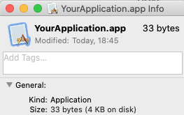
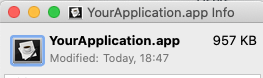

# How to make a Mac OS X .app with a shell script?

The currently accepted answer does not quite work for me. I get the little broken application icon.


The following works for me under OSX 10.15.7 (Catalina). You can feel free to change the `YourApplication`
in all of the following instructions to be the name you really want.

1. mkdir a directory with the `.app` extension in the `/Applications` folder with a `Contents` and then `MacOS` subdirectories.
```sh
mkdir -p /Applications/YourApplication.app/Contents/MacOS
```

2. Move your script into this directory and name it the same as the top application folder but without the `.app` extension and
without the shell script extension:
```sh
mv yourscript.sh /Applications/YourApplication.app/Contents/MacOS/YourApplication
```

3. Make sure your script is executable:
```sh
chmod +x /Applications/YourApplication.app/Contents/MacOS/YourApplication
```

Here's a sample application to try:
```sh
#!/bin/sh
result=`osascript -e 'display dialog "Should I beep?" buttons {"Yes", "No"}'`
if [[ "$result" = "button returned:Yes" ]]; then
    osascript -e 'beep'
fi
```

Your application should now be ready and the script should run when you double click on it. It's important to note that if you rename
the application, you will need to rename the underlying script.

Note: The script must be at least 28 bytes in size, otherwise it will not execute. It may be padded with blank lines to achieve minimum
size. Also, the first line of the script must be a shebang; e.g. `#!/bin/sh` or `#!/bin/perl`.
---
To have your application seen by LaunchPad was harder to figure out. The following seemed to work. You need to add something like the
following into the `/Applications/YourApplication.app/Contents/Info.plist` file. You might also need to move it over to a DMG file and
back to Applications for LaunchPad to notice it. See: https://stackoverflow.com/a/71342335/179850

```xml
<?xml version="1.0" encoding="UTF-8" standalone="no"?><plist version="1.0">
  <dict>
    <key>CFBundleExecutable</key>
    <string>My App</string>
    <key>CFBundleGetInfoString</key>
    <string>My App 1.0</string>
    <key>CFBundleVersion</key>
    <string>1.0</string>
    <key>CFBundleShortVersionString</key>
    <string>1.0</string>
</dict>
</plist>
```
---
To add an icon to your new application, you need to do the following:

1. Find or create a PNG that you want to be your icon.

2. Open the image in the Preview application – other graphics apps may also work.

3. Press command-a to select all and then command-c to copy it to the clipboard.

4. Select your application in the Finder and press command-i to Get Info window.

5. Click on the icon in the upper left corner of the info window to select it:



6. Paste the image from the clipboard which should change the icon.



You can also open up the Get Info window on other application, select it's icon, and copy it so you can paste it onto your new
application. After you assign any icon, if you look in your `.app` directory, you should see a filename that starts with `Icon`.

If you want to have the path of the current execution, you can add those lines at the beginning of the script:
```sh
abspath () 
{ 
case "${1}" in 
    [./]*)
    local ABSPATH="$(cd ${1%/*}; pwd)/"
    echo "${ABSPATH/\/\///}"
    ;;
    *)
    echo "${PWD}/"
    ;;
esac
}


CURRENTPATH=`abspath ${0}`
PATH=$PATH:$CURRENTPATH
```
